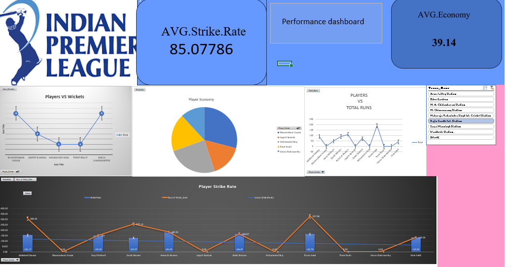

# IPL-dashboard-powerBI
Ipl Analytics
The IPL Data Analytics project is an interactive, data-driven dashboard built using Power BI / Excel Data Model. It provides a deep dive into the Indian Premier League (IPL) statistics, offering comprehensive insights into match results, team performances, individual player statistics, and venue details.
By utilizing advanced data modeling techniques (Star Schema) and DAX (Data Analysis Expressions), this dashboard allows users to dynamically filter and analyze years of IPL data to uncover trends, analyze toss decisions, track player forms, and understand home-ground advantages.

📊 Key Features
Match Analysis: Track match winners, toss winners, win margins, and win types (by runs or wickets).

Player Performance: Detailed breakdown of batting (Runs, Strike Rate, Boundaries) and bowling (Wickets, Economy, Overs) metrics.

Team Insights: Analyze team performance, captains, coaches, and home vs. away win percentages.

Venue Statistics: Understand how different stadiums (capacities, cities) impact match outcomes.

Dynamic Interactivity: Utilize slicers and dynamic visuals to filter data by teams, players, and venues instantly.

🗄️ Data Model & Schema
The project uses a highly optimized Star Schema data model consisting of two Fact tables and three Dimension tables to ensure fast calculations and smooth filtering.

Fact Tables:
fact_match: Stores match-level metrics.

Key Columns: Match_ID, Venue_ID, Team1_ID, Team2_ID, Toss_Winner, Match_Winner, Team1_Runs, Team2_Runs, Team1_Wickets, Team2_Wickets, Win_type, Win_margins, IS_Home_Team_Winner, Man_of_Match, Total_runs.

fact_player: Stores player-level performance per match.

Key Columns: Match_ID, Player_ID, Runs, Balls_Faced, Fours, Sixes, Strike_Rate, Overs_Bowled, Runs_Conceded, Wickets, Economy.

Dimension Tables:
dim_team: Details about the franchises.

Key Columns: Team_ID, Team_Name, City, Owner, Captain, Coach, Home_Ground.

dim_player: Player profiles.

Key Columns: Player_ID, Player_Name, Role, Nationality, Batting_Style, Bowling_Style, Age, Team_ID.

dim_venue: Stadium information.

Key Columns: Venue_ID, Venue_Name, City, Capacity.

🧮 DAX Measures Used
This dashboard utilizes several custom DAX measures to calculate KPIs dynamically. Some of the core measures included in the data model are:

Total Matches: DISTINCTCOUNT('fact_match'[Match_ID])

Total Runs: SUM('fact_match'[Total_runs])

Total Wickets: SUM('fact_player'[Wickets])

Player Avg Strike Rate: AVERAGE('fact_player'[Strike_Rate])

Player Economy: SUM('fact_player'[Economy])

Additional measures tracking Boundaries (Fours/Sixes), Balls Faced, and Win Margins.

🛠️ Technologies Used
Microsoft Power BI / Microsoft Excel: For dashboard visualization and interactive reporting.

Power Query: For data cleaning, transformation, and shaping.

Power Pivot / Data Model: For establishing relationships between Fact and Dimension tables.

DAX (Data Analysis Expressions): For creating calculated columns and robust measures.

📸 Dashboard Preview

💡 Future Scope
Integration of real-time or live IPL match data via APIs.

Adding predictive analytics (e.g., predicting match winners based on historical toss decisions and venue).

Deep dive into ball-by-ball data for granular phase-wise analysis (Powerplay, Middle overs, Death overs).

🤝 Contributing
Contributions, issues, and feature requests are welcome! Feel free to check the issues page if you want to contribute.
